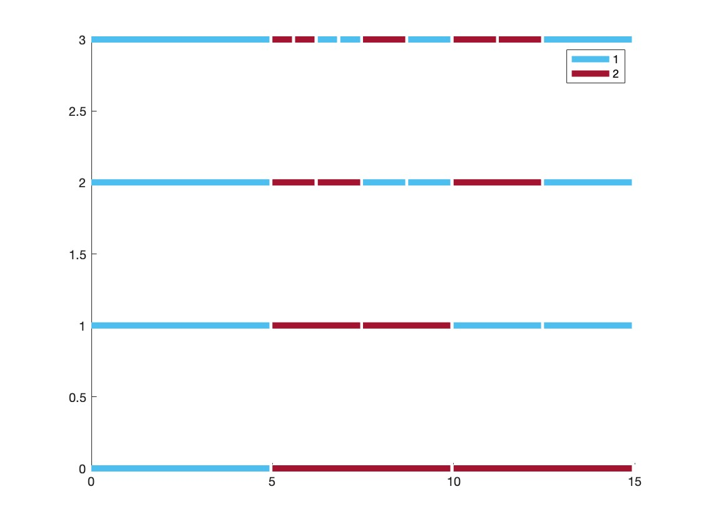

# Kolakoski Turtles: A representation of the fractal behavior of the Kolakoski sequence.

## Overview

A MATLAB script to generate the representation of the Kolakoski sequence walked by a chosen number of "turtles", to highlight the fractal behavior of the sequence.

This project was generated with [Matlab](https://it.mathworks.com/products/matlab.html) version R2022a.

## Prerequisites

Matlab version R2022a.

## Instructions

Open Matlab and run:

`[k,p] = kolakoski_sequence(n)`;

k and p represent respectively the array of the first n terms of the Kolakoski sequence and the array of the first n elements that predict the i-th element in the Kolakoski sequence.

Then run:

`turtles(k,p,height,steps)`;

where height represents the number of turtles that walk the sequence and steps the number of steps in the sequence that we want to include.
The output of this function will be a picture with the paths of the turtles.

## Example

The output of `turtles(k,p,4,10)`:

